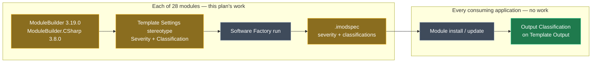

# Stamp Severity and Classification onto 102 templates across 28 modules

## Context

The attached spec, `2026-09-08-classify-template-outputs-for-review.mdx`, was written against a single consuming application (`RidgeLine.Hiring`). It proposed applying the `Output Classification` stereotype to 102 `Template Output` elements in that application's `Codebase Structure` designer — and then flagged its own weakness in a risk callout: those values are hand-added, and a module update may overwrite or strip them.

This plan does the durable version instead. `Intent.ModuleBuilder` **3.19.0** added `Severity` and `Classification` to the `Template Settings` stereotype, so a module can declare these on the template itself. The Software Factory then emits them into the module's `.imodspec`, and module install/update stamps `Output Classification` onto every consuming application automatically. One change in 28 modules replaces the same change repeated in every application that installs them.

`Intent.Application.MediatR` is already done in your working tree as the pilot — version `4.7.5-pre.0`, `ModuleBuilder` `3.19.0`, `ModuleBuilder.CSharp` `3.8.0`, six of its eight templates stamped. That commit is the reference shape for the other 27.

## The worked example

`Intent.EntityFrameworkCore.EntityTypeConfiguration` is the spec's highest-danger template: keys, cascade behaviour, `IsRequired`, `decimal(18, 2)` on money. Today the module says nothing about it. After this change its `.imodspec` entry reads:

<Diff
  id="etc-imodspec"
  filename="Modules/Intent.Modules.EntityFrameworkCore/Intent.EntityFrameworkCore.imodspec"
  before={`<template id="Intent.EntityFrameworkCore.EntityTypeConfiguration" externalReference="aba7dad6-c66b-4476-9470-0ab8786b5b4d">
  <config>
    <add key="ClassName" description="Class name formula override (e.g. '\${Model.Name}')" />
    <add key="Namespace" description="Class namespace formula override (e.g. '\${Project.Name}'" />
  </config>
  <role>Infrastructure.Data.EntityTypeConfiguration</role>
  <location>Persistence/Configurations</location>
</template>`}
  after={`<template id="Intent.EntityFrameworkCore.EntityTypeConfiguration" externalReference="aba7dad6-c66b-4476-9470-0ab8786b5b4d">
  <config>
    <add key="ClassName" description="Class name formula override (e.g. '\${Model.Name}')" />
    <add key="Namespace" description="Class namespace formula override (e.g. '\${Project.Name}'" />
  </config>
  <role>Infrastructure.Data.EntityTypeConfiguration</role>
  <location>Persistence/Configurations</location>
  <severity>high</severity>
  <classifications>Persistence Schema</classifications>
</template>`}
  annotations={[
    { side: "after", lines: "8-9", label: "Emitted, not hand-written", note: "Set on the C# Template element in the Module Builder designer; the Software Factory writes these two lines" },
  ]}
/>

Every application that installs `Intent.EntityFrameworkCore` at the new version then gets `Output Classification` stamped onto its own `EntityTypeConfiguration` Template Output — no per-application work at all.

## Approach

The change is entirely **model-side in each module's own Module Builder designer**, then regenerated. No template C# is touched, and no consuming application's generated code changes.

<Callout id="decision-spec-wins" tone="decision" title="The spec's taxonomy is authoritative; MediatR gets realigned">

You chose spec-wins, so the pilot's two divergences are corrected rather than propagated:

- The two AI skill templates (`CommandHandlerSkillTemplate`, `QueryHandlerSkillTemplate`) lose `2 - Medium` / `AI Guidance` and return to the default `0 - None` with an empty `Classification`.
- `Intent.Application.MediatR.CommandModels` and `.QueryModels` gain the `Security` classification the pilot omitted, becoming `API Contract;Security`. Their severity **stays** `3 - High` — the API Contract override below lands them exactly where the pilot already had them, so only the classification string changes.

That retires `AI Guidance` before it spreads, leaving exactly the spec's **10 classifications**. All seven skill templates across the repo stay unclassified, which is the spec's deliberate "never warrants review attention" signal — absence, not a label.

`Intent.Application.MediatR` is at `4.7.5-pre.0` and unpublished, so realigning it is a correction in flight, not a second version bump.

</Callout>

<Callout id="decision-api-contract-high" tone="decision" title="Override: anything classified API Contract is High">

Your instruction overrides the spec's tiering for one classification. Every template carrying `API Contract` — alone or alongside another classification — is `3 - High`, wherever the spec placed it. **14 templates move up**: nine from Medium, five from Low.

It holds on the spec's own terms. An API contract is the one thing in a change set whose breakage lands on a consumer the reviewer cannot see and cannot fix: a reordered enum, a dropped DTO member or a changed route is silent locally and irreversible once clients have bound to it. That is the same "irreversible or invisible to tests" test that put `Persistence Schema` at High.

<Table
  id="api-contract-promotions"
  caption="The 14 templates promoted to High"
  density="compact"
  columns={["Template", "Classification", "Spec tier"]}
  rows={[
    ["`Intent.AspNetCore.Controllers.Controller`", "`API Contract;Security`", "Medium"],
    ["`Intent.Application.MediatR.CommandModels`", "`API Contract;Security`", "Medium *(pilot already High)*"],
    ["`Intent.Application.MediatR.QueryModels`", "`API Contract;Security`", "Medium *(pilot already High)*"],
    ["`Intent.Application.Dtos.DtoModel`", "`API Contract`", "Medium"],
    ["`Intent.Application.Dtos.ContractEnumModel`", "`API Contract`", "Medium"],
    ["`Intent.Application.Contracts.ServiceContract`", "`API Contract`", "Medium"],
    ["`Intent.AspNetCore.ProblemDetailsConfiguration`", "`API Contract`", "Medium"],
    ["`Intent.AspNetCore.Versioning.ApiVersioningConfiguration`", "`API Contract`", "Medium"],
    ["`Intent.AspNetCore.Controllers.ExceptionFilter`", "`Request Pipeline;API Contract`", "Medium"],
    ["`Intent.Application.Dtos.Pagination.PagedResult`", "`API Contract`", "Low"],
    ["`Intent.Application.Dtos.Pagination.CursorPagedResult`", "`API Contract`", "Low"],
    ["`Intent.AspNetCore.Controllers.JsonResponse`", "`API Contract`", "Low"],
    ["`Intent.AspNetCore.Controllers.BinaryContentAttribute`", "`API Contract`", "Low"],
    ["`Intent.AspNetCore.IntegrationTesting.ProxyServiceContract`", "`Tests;API Contract`", "Low"],
  ]}
/>

Tier split becomes **31 High / 30 Medium / 32 Low / 9 None** — still 102 templates. Which templates get values does not change, only where they sit.

</Callout>

<Callout id="warn-api-contract-edges" tone="warning" title="Three of the fourteen are arguably plumbing rather than contract">

`Intent.AspNetCore.Controllers.JsonResponse` and `.BinaryContentAttribute` are response-wrapping helpers, and `Intent.AspNetCore.IntegrationTesting.ProxyServiceContract` is a test-side proxy that mirrors a contract rather than defining one. A blanket rule seats all three beside `Intent.Entities.DomainEntity` at High, and High is now the largest tier at 31 of 102 — a filter set to High shows just under a third of the classified set.

Applied as instructed, because carving out exceptions reintroduces exactly the per-template judgement the classification exists to replace, and because over-flagging costs a glance. If you would rather those three stayed Low, dropping `API Contract` from their classification is the cleaner fix than exempting them from the rule.

</Callout>

### Scope, resolved from the imodspecs

The spec named 120 Template Outputs seen in one application. Resolving each template id against every `.imodspec` in this repo lands them in **28 modules holding 118 templates between them** — and the split falls out almost exactly as the spec predicted.

<Table
  id="scope-totals"
  caption="How the spec's 120 map onto this repo"
  columns={["Bucket", "Count", "Where it lands"]}
  rows={[
    ["Templates getting `Severity` + `Classification`", "**102**", "28 modules in this repo"],
    ["Templates deliberately left at `0 - None` / blank", "16", "Same 28 modules — no action, the default already is 'unclassified'"],
    ["Spec-unclassified templates outside these 28", "2", "`Intent.Application.FluentValidation` (skill template) and the `Intent.Modules.Common.CSharp` SDK — untouched"],
  ]}
/>

The 16 in-scope unclassified templates need **no** designer edit: once `ModuleBuilder` 3.19.0 is installed, `Severity` defaults to `0 - None` and `Classification` to empty, and the Software Factory emits neither element. Absence in the `.imodspec` is exactly the signal the spec wants.

### Per-module work

<Table
  id="per-module"
  caption="28 modules — current state and target version. `Cls` is templates receiving values; `—` is those left at default."
  density="compact"
  columns={["Module", "Version → target", "Client floor", "MB / MB.CSharp", "Cls", "—"]}
  rows={[
    ["`Intent.Modules.Application.MediatR`", "`4.7.5-pre.0` (in flight)", "5.1.0 ✓", "3.19.0 / 3.8.0 ✓", "4", "4"],
    ["`Intent.Modules.AspNetCore.IntegrationTesting`", "`2.0.20` → `2.0.21-pre.0`", "5.0.0-pre.0 → **5.1.0**", "3.18.9 / 3.7.6", "18", "1"],
    ["`Intent.Modules.Entities.Repositories.Api`", "`5.2.1` → `5.2.2-pre.0`", "5.0.0 → **5.1.0**", "3.18.0-pre.1 / 3.7.4-pre.0", "7", "0"],
    ["`Intent.Modules.EntityFrameworkCore`", "`5.2.0-pre.2` → `5.2.0-pre.3` *(gate first)*", "5.0.0 → **5.1.0**", "3.18.7-pre.0 / 3.7.5-pre.0", "6", "1"],
    ["`Intent.Modules.Application.MediatR.Behaviours`", "`4.7.1` → `4.7.2-pre.0`", "5.0.0 → **5.1.0**", "3.18.0-pre.1 / 3.7.4-pre.0", "6", "0"],
    ["`Intent.Modules.Application.Identity`", "`3.6.3` → `3.6.4-pre.0`", "5.0.0 → **5.1.0**", "3.17.1 / 3.7.4", "6", "1"],
    ["`Intent.Modules.EntityFrameworkCore.Repositories`", "`4.8.5` → `4.8.6-pre.0`", "5.0.0 → **5.1.0**", "3.18.8 / 3.7.4-pre.0", "5", "1"],
    ["`Intent.Modules.AspNetCore.Controllers`", "`7.1.14` → `7.1.15-pre.0`", "5.0.0 → **5.1.0**", "3.17.1 / 3.7.4-pre.0", "5", "0"],
    ["`Intent.Modules.AspNetCore`", "`6.1.5` → `6.1.6-pre.0`", "4.5.15 → **5.1.0** ⚠", "3.17.1 / 3.7.4-pre.0", "5", "0"],
    ["`Intent.Modules.Application.FluentValidation.Dtos`", "`3.13.3` → `3.13.4-pre.0`", "5.0.0 → **5.1.0**", "3.18.0-pre.1 / 3.7.4-pre.0", "5", "0"],
    ["`Intent.Modules.Entities`", "`5.3.3` → `5.3.4-pre.0`", "5.0.0 → **5.1.0**", "3.18.6-pre.0 / 3.7.6", "4", "6"],
    ["`Intent.Modules.Application.MediatR.FluentValidation`", "`4.12.2` → `4.12.3-pre.0`", "5.0.0 → **5.1.0**", "3.18.4 / 3.7.6", "4", "0"],
    ["`Intent.Modules.Application.Dtos.Pagination`", "`4.2.1` → `4.2.2-pre.0`", "4.5.18 → **5.1.0** ⚠", "3.17.1 / 3.7.4-pre.0", "4", "0"],
    ["`Intent.Modules.Hangfire`", "`1.0.12` → `1.0.13-pre.0`", "4.4.0 → **5.1.0** ⚠", "3.17.1 / 3.7.4-pre.0", "3", "0"],
    ["`Intent.Modules.AspNetCore.Swashbuckle`", "`6.0.4` → `6.0.5-pre.0`", "5.0.0 → **5.1.0**", "3.17.1 / 3.7.4-pre.0", "3", "0"],
    ["`Intent.Modules.AspNetCore.Versioning`", "`1.1.14` → `1.1.15-pre.0`", "4.6.0 → **5.1.0** ⚠", "3.17.1 / 3.7.4-pre.0", "2", "0"],
    ["`Intent.Modules.Application.Dtos.AutoMapper`", "`4.0.22` → `4.0.23-pre.0`", "5.0.0 → **5.1.0**", "3.18.0-pre.1 / 3.7.4-pre.0", "2", "0"],
    ["`Intent.Modules.Application.Dtos`", "`4.6.0` → `4.6.1-pre.0`", "5.0.0 → **5.1.0**", "3.18.1 / 3.7.4-pre.0", "2", "0"],
    ["`Intent.Modules.Application.AutoMapper`", "`5.3.10` → `5.3.11-pre.0`", "5.0.0-pre.0 → **5.1.0**", "3.18.6-pre.0 / 3.7.6", "2", "0"],
    ["`Intent.Modules.ValueObjects`", "`4.2.8` → `4.2.9-pre.0`", "4.4.0 → **5.1.0** ⚠", "3.17.1 / 3.7.4-pre.0", "1", "1"],
    ["`Intent.Modules.Application.ServiceImplementations`", "`4.7.4` → `4.7.5-pre.0`", "5.0.0 → **5.1.0**", "3.18.6-pre.0 / 3.7.6", "1", "1"],
    ["`Intent.Modules.Infrastructure.DependencyInjection`", "`4.1.18` → `4.1.19-pre.0`", "5.0.0 → **5.1.0**", "3.17.1 / 3.7.4-pre.0", "1", "0"],
    ["`Intent.Modules.EntityFrameworkCore.DiffAudit`", "`1.0.4` → `1.0.5-pre.0`", "4.4.0 → **5.1.0** ⚠", "3.17.1 / 3.7.4-pre.0", "1", "0"],
    ["`Intent.Modules.AspNetCore.Swashbuckle.Security`", "`5.0.1` → `5.0.2-pre.0`", "5.0.0 → **5.1.0**", "3.18.2 / 3.7.6", "1", "0"],
    ["`Intent.Modules.AspNetCore.Logging.Serilog`", "`5.3.9` → `5.3.10-pre.0`", "5.0.0 → **5.1.0**", "3.17.1 / 3.7.4-pre.0", "1", "0"],
    ["`Intent.Modules.AspNetCore.HealthChecks`", "`2.0.15` → `2.0.16-pre.0`", "4.6.0 → **5.1.0** ⚠", "3.17.1 / 3.7.4-pre.0", "1", "0"],
    ["`Intent.Modules.Application.DependencyInjection`", "`4.1.17` → `4.1.18-pre.0`", "5.0.0 → **5.1.0**", "3.17.1 / 3.7.4-pre.0", "1", "0"],
    ["`Intent.Modules.Application.Contracts`", "`5.1.5` → `5.1.6-pre.0`", "4.5.8 → **5.1.0** ⚠", "3.18.4 / 3.7.6", "1", "0"],
  ]}
/>

<Callout id="risk-client-floor" tone="risk" title="Seven modules lose their pre-5.1 consumers, and this is the only irreversible part">

`ModuleBuilder` 3.19.0 and `ModuleBuilder.CSharp` 3.8.0 both declare `supportedClientVersions` of `[5.1.0-a, 6.0.0-a)`. That becomes the dependency floor for every module that installs them, exactly as it did for the MediatR pilot (`[5.0.0-a` → `[5.1.0-a`).

For 20 of the modules that is a step from 5.0.x, which is minor. For the seven marked ⚠ it is a jump across a major client version — `Intent.AspNetCore` from 4.5.15, `Intent.Modules.Hangfire`, `ValueObjects` and `EntityFrameworkCore.DiffAudit` from 4.4.0, `AspNetCore.HealthChecks` and `AspNetCore.Versioning` from 4.6.0, `Application.Contracts` from 4.5.8, `Application.Dtos.Pagination` from 4.5.18.

Applications on Intent Architect 4.x stop seeing updates to those modules from this version on. They are not broken — they simply stay on what they have. That is what makes patch the right component, but it is genuinely one-way: the floor cannot be lowered again without dropping back off ModuleBuilder 3.19.

If any of those seven still has 4.x consumers you care about, say so now and hold it back — the other 21 are independent and can ship without it.

</Callout>

<Callout id="warn-global-defaults" tone="warning" title="Severities tuned for one application become the default for every application">

The spec's ratings were reasoned from `RidgeLine.Hiring`: what an agent edits there, what its tests cover, what its money-precision configuration risks. Stamping them into the modules makes them the default for every consumer, including applications with a very different risk profile — one with no financial data still gets `EntityTypeConfiguration` at High.

Accepted, for the reason the spec already gave for the same tradeoff one level down: over-flagging costs a glance, under-flagging costs a defect. It is also recoverable in a way the client floor is not — a consuming application can override the stamped `Output Classification` on its own Template Output, and the module value is a default rather than a lock.

</Callout>

<Callout id="warn-inflight-gate" tone="warning" title="The version table is the expected outcome, not a script — run the gate per module">

`module-version-increment` is explicit that a version moves **only** when a published version already exists at or beyond it. `Intent.Modules.EntityFrameworkCore` sits at `5.2.0-pre.2`; if that prerelease was never published it is in flight and must be **left alone**, not moved to `pre.3`. The same test applies to every row.

So: search the feeds with prereleases included, per module, before applying the target column. Ignore results from the machine-local build-output repository (`D:\Dev\.intent-modules`) — those are your own builds, not a publication.

</Callout>

## Model changes

For each module, in its **Module Builder** designer:

- Update `modules.config` to `Intent.ModuleBuilder` **3.19.0** and `Intent.ModuleBuilder.CSharp` **3.8.0** via `install_or_update_modules` — never by hand-editing the file.
- On each `C# Template` / `File Template` / `Static Content Template` element in scope, set two properties on the already-present `Template Settings` stereotype.
- On the `Intent Module` element, set `Module Settings` → `Version` to the target above.

<Table
  id="stereotype-mechanics"
  caption="The two properties, by id — identical across all three template-settings stereotypes"
  density="compact"
  columns={["Property", "Id", "Accepted value", "Emitted as"]}
  rows={[
    ["`Severity`", "`2358e2a0-7a0b-41bd-94cd-dfe56dd49d9f`", "One of `0 - None`, `1 - Low`, `2 - Medium`, `3 - High`", "`severity` element, lowercased word — omitted when `0 - None`"],
    ["`Classification`", "`3fa91ea8-0b2a-423f-b347-432924a4ec2f`", "Free text, **semicolon-separated** for multiple", "`classifications` element — omitted when blank"],
  ]}
/>

The stereotype that carries them differs by template kind, which matters when writing the designer script:

- `b1f08a30-9aae-4702-bfc8-e285e6b43a61` — `Template Settings`, applies to templates referencing `Single File`, `File Per Model` or `Custom`. This covers all but one in-scope template.
- `1fd8fd68-ff20-437c-8c00-ac77920d7ff0` — `Template Settings` for `Static Content Template`. Only `Intent.Modules.AspNetCore.IntegrationTesting.Templates.StaticContentTemplateRegistrations.StaticFilesStaticContentTemplateRegistration` needs it, at `0 - None` / `Tests`.

The per-template values come from the four severity tables in the attached spec — `sev-high`, `sev-medium`, `sev-low`, `sev-none` — with **one override applied on top**: any template whose classification includes `API Contract` takes `3 - High` instead of the spec's tier. Apply the override last, as a sweep over the assembled set, so it cannot be missed on a template the spec filed under Low.

Where the spec lists two classifications, join them with a semicolon and no space: `API Contract;Security`, `Security;App Composition`, `Request Pipeline;Persistence Schema`, `Tests;Security`, `Request Pipeline;API Contract`, `Tests;API Contract`.

## Code changes

None. No template C# changes, and the Software Factory regenerates `.imodspec`, `.csproj` `Version`, and the release-notes wiring from the model. Do not hand-edit any of them.

## Steps

1. **Run the version gate across all 27 remaining modules.** Search the configured feeds with prereleases included for each module id, discarding `D:\Dev\.intent-modules` results as machine-local. Record, per module, whether it is in flight (leave alone) or published (apply the target from the table). Do this once, up front, as `module-building-workflow` Phase 2 requires — not module by module as you go.

2. **Take the MediatR realignment first, as the smallest end-to-end proof.** Add `;Security` to the `Classification` on `CommandModels` and `QueryModels`, leaving their `3 - High` severity alone, and clear the two skill templates back to `0 - None` with empty `Classification`. Regenerate and confirm the `.imodspec` diff shows exactly four entries changing — two gaining a classification, two losing both elements — with the version staying at `4.7.5-pre.0` and `AI Guidance` gone from the file. This validates the whole mechanism against a module already on 3.19.0, before any upgrade risk is introduced.

3. **Roll the remaining 27 in batches, heaviest first.** Per module: `install_or_update_modules` for `Intent.ModuleBuilder` 3.19.0 and `Intent.ModuleBuilder.CSharp` 3.8.0; one `run_designer_script` setting `Version` plus every in-scope template's `Severity` and `Classification` in a single cohesive script; append a release-notes entry; `run_software_factory`; inspect via `get_file_diffs`; `apply_staged_file_changes`. Suggested batching — the four EF/persistence modules, then the six ASP.NET Core ones, then Application/MediatR, then the singles.

4. **Write the release-notes entry as part of the same turn as each module's change.** Match the pilot's wording so the 28 entries read as one release: `- Improvement: Added default Template Classification and Priorities.` under a `### Version <target>` heading. `module-docs-chore` requires this in-turn rather than batched at the end.

5. **Reconcile the totals.** Across the 28 modules, exactly **102** templates carry a non-default `Severity` or a non-empty `Classification`, split **31 High / 30 Medium / 32 Low / 9 None** by tier, and the 16 named as unclassified emit neither element. Then run the override as its own check: every `classifications` element containing `API Contract` must sit on a template whose `severity` reads `high` — zero exceptions. Confirm no `.imodspec` contains `AI Guidance`.

6. **Confirm `supportedClientVersions` landed at `[5.1.0-a, 6.0.0-a)`** on all 28, and that no module's `.imodspec` version regressed — the downgrade guard in `module-version-increment` silently skips regeneration when the new version sorts below what is on disk, reporting nothing staged.

## Critical files and elements

- `Modules/Intent.Modules.Application.MediatR/**` — the committed reference shape for every other module. Its uncommitted diff shows exactly which files a correct change touches.
- `Modules/<Module>/modules.config` — the `Intent.ModuleBuilder` / `Intent.ModuleBuilder.CSharp` pins. Changed only through `install_or_update_modules`.
- `Modules/<Module>/<Id>.imodspec` — the deliverable: `severity` and `classifications` per template, plus `version` and `supportedClientVersions`. Generated, never hand-edited.
- `Modules/<Module>/release-notes.md` and `Modules/<Module>/<Module>.csproj` — the other two places the version must agree.
- Stereotype `Template Settings` (`b1f08a30-…`) and its Static Content twin (`1fd8fd68-…`) in the Module Builder designer — where `Severity` and `Classification` actually live.

## Verification

<Checklist
  id="verify"
  items={[
    { id: "v1", label: "All 28 modules pin `Intent.ModuleBuilder` `3.19.0` and `Intent.ModuleBuilder.CSharp` `3.8.0`", note: "`grep -h 'Intent.ModuleBuilder\"' Modules/*/modules.config` over the 28 shows one version" },
    { id: "v2", label: "Exactly **102** template entries across the 28 `.imodspec` files carry a `severity` or `classifications` element" },
    { id: "v3", label: "Tier split is 31 high / 30 medium / 32 low / 9 none-with-classification" },
    { id: "v3b", label: "**Every** `classifications` element containing `API Contract` sits on a `high` entry — zero exceptions across all 28 `.imodspec` files" },
    { id: "v4", label: "The 16 in-scope unclassified templates emit neither element — spot-check `Intent.Entities.DomainEntityState` and `Intent.Application.MediatR.CommandInterface`" },
    { id: "v5", label: "No `.imodspec` contains `AI Guidance`; only the spec's 10 classification names appear" },
    { id: "v6", label: "Version agrees across `.imodspec`, `.csproj` and the designer `Module Settings` for every changed module" },
    { id: "v7", label: "`release-notes.md` has a matching `### Version` heading for each target version" },
    { id: "v8", label: "`supportedClientVersions` reads `[5.1.0-a, 6.0.0-a)` on all 28" },
    { id: "v9", label: "`get_designer_validation_errors` clean for each changed Module Builder designer" },
    { id: "v10", label: "Spot-check the danger ordering", note: "`EntityTypeConfiguration` high, `DtoModel` high *(promoted)*, `PagedResult` high *(promoted)*, `CommandHandler` medium, `AuthorizeCheckOperationFilter` low, `CommandInterface` absent" },
  ]}
/>

End-to-end proof is out of scope by your choice of *model + regenerate only*: compiling the modules and installing them into a consuming application to watch `Output Classification` appear is left to the normal pipeline.

## Open questions resolved

- **Q:** The MediatR pilot diverges from the spec on request-model severity and introduces an `AI Guidance` classification. Which wins? **A:** The spec for the taxonomy — skill templates return to unclassified and `AI Guidance` is retired before it spreads. The request models keep their `3 - High`, not because the pilot set it but because the API Contract override below independently puts them there; they only gain the missing `Security` classification.
- **Q:** How should `API Contract` be tiered? **A:** Always `3 - High`, overriding the spec. Fourteen templates move up — nine from Medium, five from Low — taking the split to 31 / 30 / 32 / 9. Contract breakage is invisible locally and irreversible once clients have bound to it, which is the same test that put `Persistence Schema` at High. The three arguably-plumbing cases are accepted rather than exempted; see the warning callout above for the cleaner alternative if you change your mind.
- **Q:** What version increment, given the client floor rises to 5.1.0? **A:** Patch plus `-pre.0`, matching the pilot. Template metadata changes nothing already generated, and a narrowed floor means older clients stop receiving updates rather than breaking.
- **Q:** How far does implementation go per module? **A:** Model changes plus a Software Factory run so `.imodspec`, `.csproj` and release notes regenerate. No `dotnet build`, no packaging, no publishing.
- **Q:** Which of the spec's 120 Template Outputs are actually in this repo? **A:** 118 of them live in 28 modules here — 102 get values, 16 stay at the default. The remaining two belong to `Intent.Application.FluentValidation` and the `Intent.Modules.Common.CSharp` SDK and are out of scope, both being templates the spec leaves unclassified anyway.
